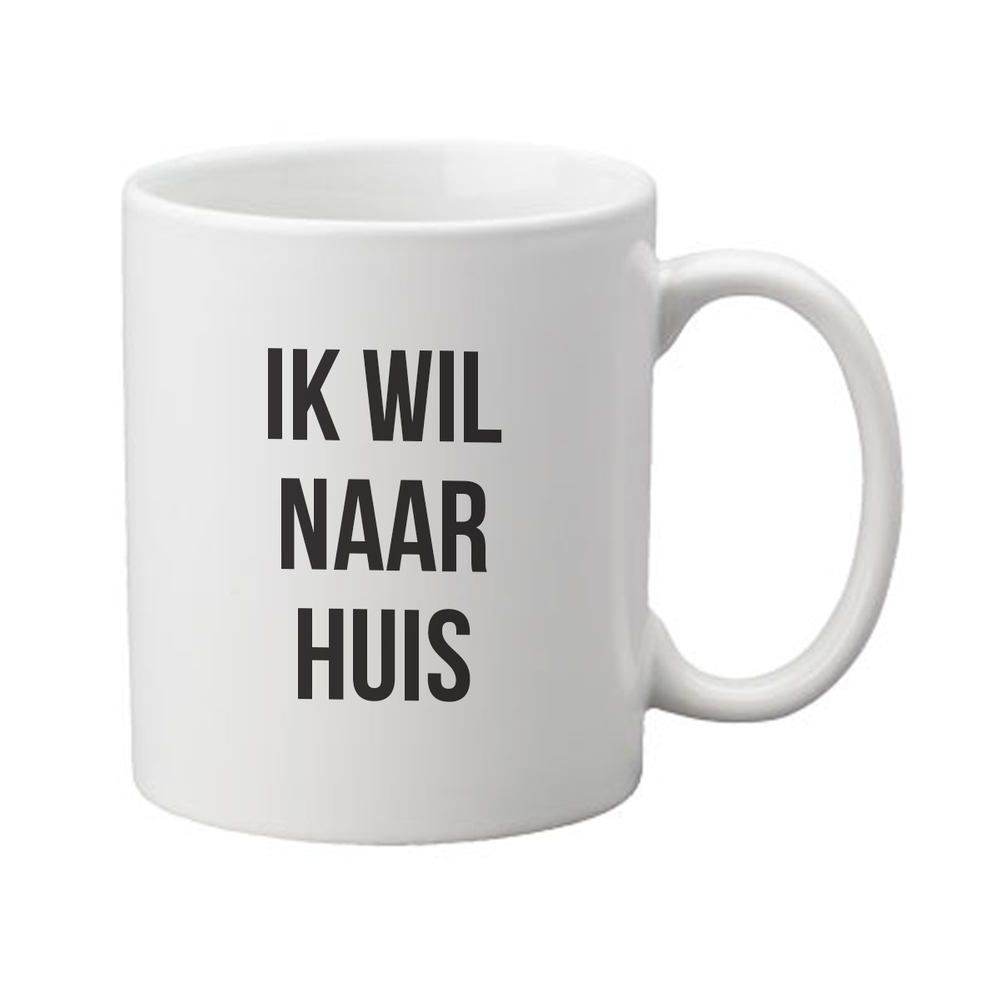

=============
ikwilnaarhuis
=============

A Python CLI tool to help out those people who often feel like 'IK WIL NAAR HUIS'.

Usage
===========

``ikwilnaarhuis``

Running the tool without supplying parameters calculates how long you should work today if you need to work 7.8 hours.

``ikwilnaarhuis 9 15``

Running the tool while supplying two integers (whole numbers) is considered the standard way of runninng it, calculateing how long you have to work if you stated at 09:15, assuming a standard lunch break of 60 minutes. 

``ikwilnaarhuis -t 9 15``

Suppling the -t or --time parameters results in the same calculation as above.

``ikwilnaarhuis -t 9 15 -l 60``

Suppling the -l or --lunch parameter allow you to enter a custom lunch break duration, rannging between 30 and 90 minutes.

``ikwilnaarhuis -r 17 30``

Supplying the -r or --reverse parameters allow you to calculate when you should start, given a specified time you want to leave. In this example, you would calculate the time you need to start working when you want to leave, assuming a standard lunch break of 60 minutes.

``ikwilnaarhuis -v`` or ``ikwilnaarhuis --version``

Suppling the -v or --version allows you to check your version of the 'ikwilnaarhuis' tool.
